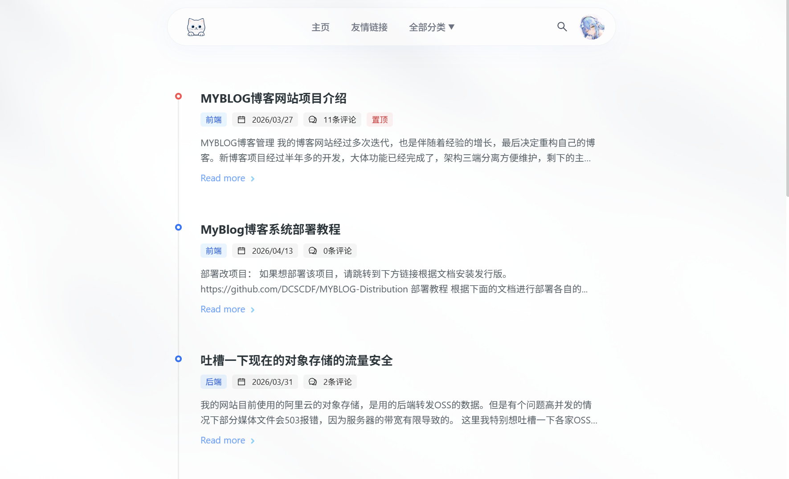
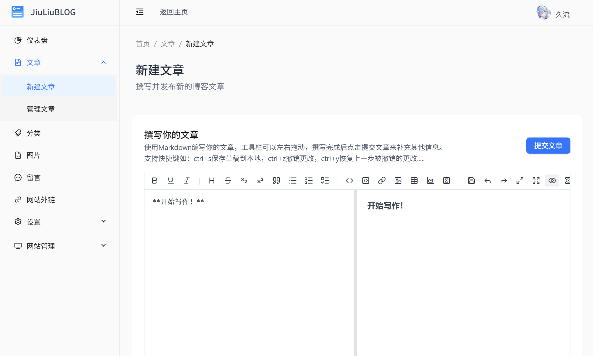
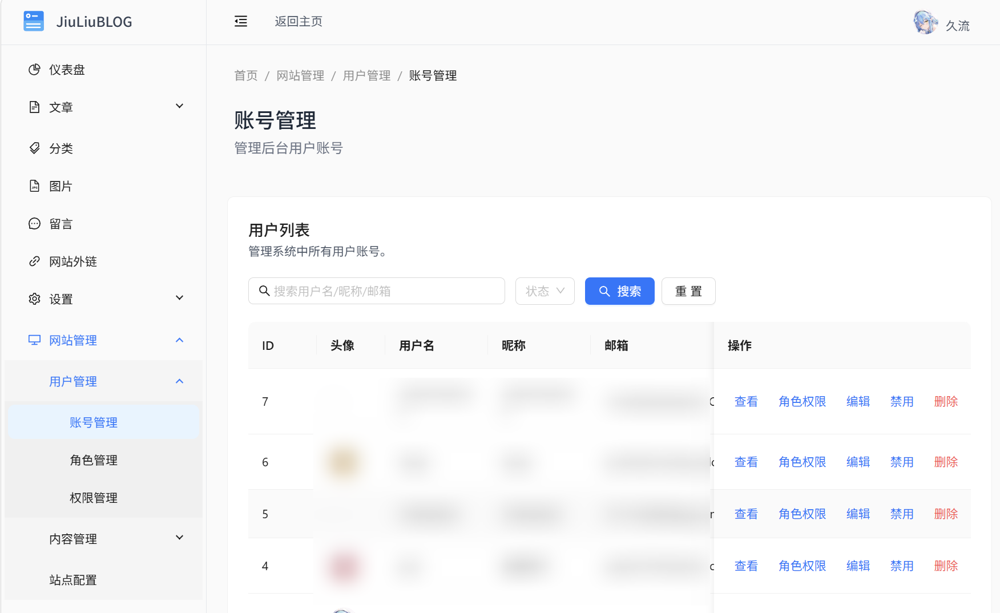

<h1 align="center" style="margin: 30px 0 30px; font-weight: bold;">MyBlog 博客/CMS管理系统</h1>

---
## 项目使用的技术栈
### 后端

### 前端 

### 前端-管理端

---

## 部署教程
根据下面的文档进行部署各自的模块。点击右上角的CODE按钮，选择下载ZIP压缩包，下载完成解压后根据下面的文档进行部署。

> - [后端部署教程](MyBlogSERVER/readme.md)
> - [前端部署教程](MyBlogWEB/readme.md)
> - [前端-后台管理部署教程](MyBlogWEB_ADMIN/readme.md)

## 预览图

## 定制前台页面

需要自己开发前台页面的话，后端暴露了如下接口，根据接口开发前台页面。

> - [Auth_Api.md 用户接口文档](devdoc/Auth_Api.md)

> - [PublicArticle_Api.md 文章接口文档](devdoc/PublicArticle_Api.md)

> - [PublicCategory_Api.md 分类接口文档](devdoc/PublicCategory_Api.md)

> - [PublicComment_Api.md 评论接口文档](devdoc/PublicComment_Api.md)

> - [PublicFriendLink_Api.md 友情链接接口文档](devdoc/PublicFriendLink_Api.md)

> - [PublicRss_Api.md rss接口文档](devdoc/PublicRss_Api.md)